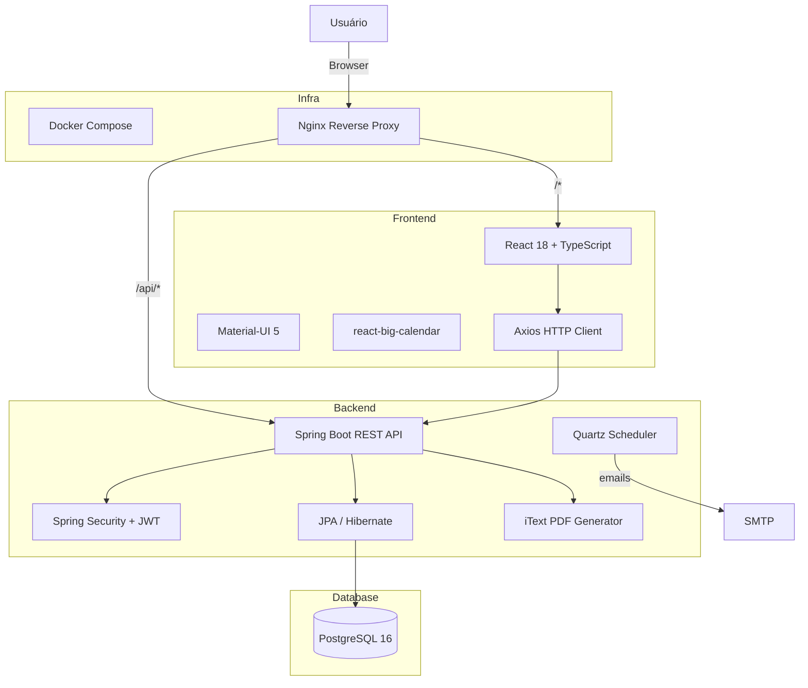
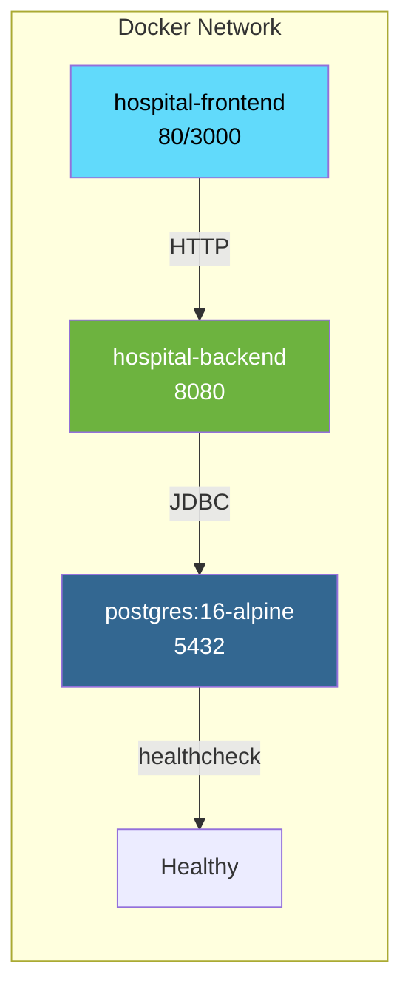
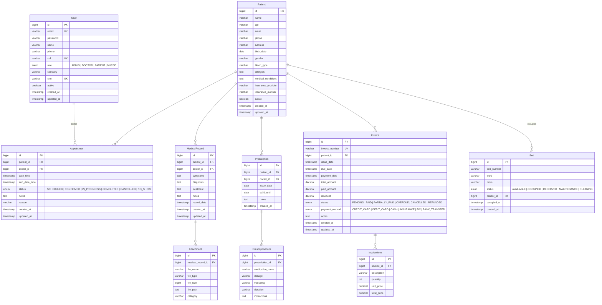
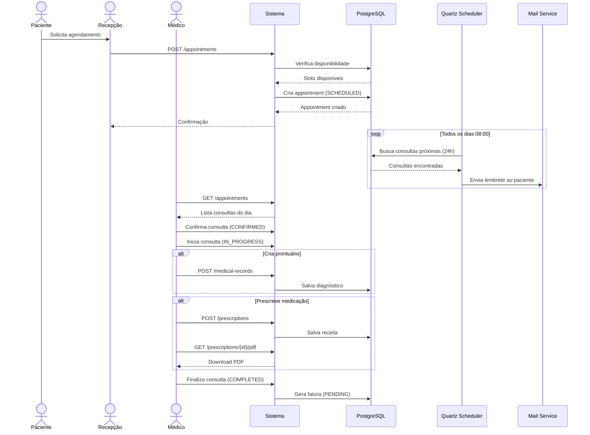
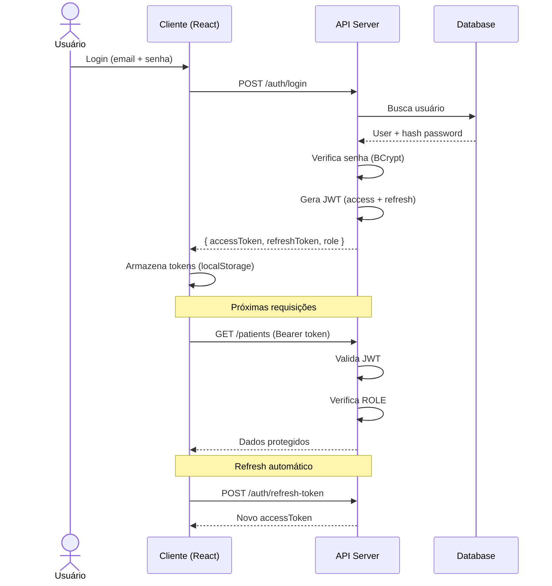
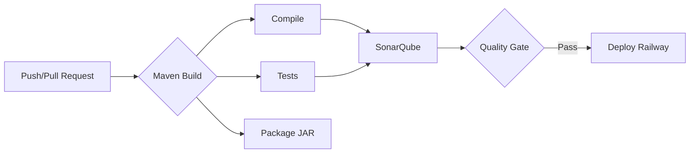

# 🏥 Hospital Management System

Sistema completo de gestão hospitalar com frontend React e backend Java Spring Boot. Projetado para atender clínicas e hospitais de pequeno a médio porte com módulos de agendamento, prontuário eletrônico, prescrições, controle de leitos e faturamento.

---

## 📋 Índice

- [Arquitetura](#-arquitetura)
- [Modelagem de Dados (ERD)](#-modelagem-de-dados-erd)
- [Fluxo de Agendamento](#-fluxo-de-agendamento)
- [Stack Tecnológica](#-stack-tecnológica)
- [Segurança e RBAC](#-segurança-e-rbac)
- [Endpoints da API](#-endpoints-da-api)
- [Quick Start](#-quick-start)
- [Estrutura do Projeto](#-estrutura-do-projeto)
- [Compliance](#-compliance)
- [CI/CD](#-cicd)
- [Licença](#-licença)

---

## 🏗️ Arquitetura



### Diagrama de Containers (Docker)



---

## 📊 Modelagem de Dados (ERD)



---

## 🔄 Fluxo de Agendamento



---

## 🛠️ Stack Tecnológica

### Frontend

| Tecnologia | Versão | Finalidade |
|------------|--------|------------|
| React | 18.2 | Framework SPA |
| TypeScript | 4.9 | Tipagem estática |
| Material-UI | 5.15 | Design System |
| react-big-calendar | 1.11 | Calendário de consultas |
| Axios | 1.6 | HTTP Client |
| react-router-dom | 6.22 | Roteamento |
| react-toastify | 10.0 | Notificações |
| date-fns | 3.6 | Manipulação de datas |

### Backend

| Tecnologia | Versão | Finalidade |
|------------|--------|------------|
| Java | 17 | Runtime |
| Spring Boot | 3.2.4 | Framework |
| Spring Security | 6.2 | Autenticação/autorização |
| JPA / Hibernate | 6.4 | ORM |
| PostgreSQL | 16 | Banco de dados |
| JWT (jjwt) | 0.12.5 | Tokens |
| iText | 8.0.4 | Geração de PDF |
| Quartz Scheduler | 2.3 | Tarefas agendadas |
| Swagger/OpenAPI | 2.5 | Documentação |
| Lombok | 1.18 | Redução de boilerplate |

### Infraestrutura

| Tecnologia | Finalidade |
|------------|------------|
| Docker | Containerização |
| Docker Compose | Orquestração |
| Nginx | Servidor web / proxy reverso |
| GitHub Actions | CI/CD |

---

## 🔒 Segurança e RBAC

### Modelo de Autorização (RBAC)

| Funcionalidade | ADMIN | DOCTOR | NURSE | PATIENT |
|----------------|:-----:|:------:|:-----:|:-------:|
| Gerenciar Usuários | ✅ | ❌ | ❌ | ❌ |
| CRUD Pacientes | ✅ | ✅ | ✅ | ❌ |
| Agendamentos | ✅ | ✅ | ✅ | 👁️ |
| Prontuários | ✅ | ✅ | ✅ | ❌ |
| Prescrições | ✅ | ✅ | ❌ | ❌ |
| Leitos | ✅ | ✅ | ✅ | ❌ |
| Faturamento | ✅ | ❌ | ❌ | 👁️ |
| Relatórios | ✅ | ❌ | ❌ | ❌ |

👁️ = Visualização apenas

### Fluxo de Autenticação



### Camadas de Segurança

- **Senhas**: Hash com BCrypt (Spring Security)
- **JWT**: HMAC-SHA384 com chave de 256 bits
- **Tokens**: Access token (24h) + Refresh token (7d)
- **Transporte**: TLS/SSL via Nginx (produção)
- **CORS**: Configurado para múltiplas origens
- **CSRF**: Desabilitado (API stateless com JWT)
- **Validação**: Bean Validation em todas as entradas

---

## 📡 Endpoints da API

### Autenticação
```http
POST /auth/login              # Login
POST /auth/register            # Registro
POST /auth/refresh-token       # Refresh JWT
```

### Pacientes
```http
GET    /patients?page=0&size=10          # Listar (paginado)
POST   /patients                          # Cadastrar
GET    /patients/{id}                     # Detalhes
PUT    /patients/{id}                     # Atualizar
DELETE /patients/{id}                     # Desativar
```

### Consultas
```http
POST   /appointments                                    # Agendar
GET    /appointments?patientId=1&page=0                # Listar por paciente
GET    /appointments?doctorId=1&page=0                 # Listar por médico
PUT    /appointments/{id}                               # Remarcar
DELETE /appointments/{id}                               # Cancelar
GET    /appointments/available-slots?doctorId=1&date=2026-05-21  # Horários
```

### Prontuário
```http
POST   /medical-records                          # Criar registro
GET    /medical-records/patient/{id}             # Histórico do paciente
PUT    /medical-records/{id}                     # Atualizar
POST   /medical-records/{id}/attachments         # Anexar exame
```

### Prescrições
```http
POST   /prescriptions                        # Criar receita
GET    /prescriptions/patient/{id}           # Receitas do paciente
GET    /prescriptions/{id}/pdf               # Download PDF
```

### Leitos
```http
GET    /beds                        # Listar todos
POST   /beds                        # Cadastrar leito
POST   /beds/{id}/occupy           # Ocupar leito
POST   /beds/{id}/release          # Liberar leito
PUT    /beds/{id}/status           # Atualizar status
GET    /beds/stats                 # Estatísticas
```

### Faturamento
```http
POST   /invoices                        # Criar fatura
GET    /invoices/patient/{id}           # Faturas do paciente
GET    /invoices/{id}                   # Detalhes
POST   /invoices/{id}/pay              # Pagamento
POST   /invoices/{id}/cancel           # Cancelar
```

> Documentação interativa disponível em `http://localhost:8080/swagger-ui.html`

---

## 🚀 Quick Start

### Pré-requisitos

- Docker Engine 24+
- Docker Compose v2+

### Instalação

```bash
# Clone o repositório
git clone https://github.com/seu-usuario/hospital-management-system.git
cd hospital-system

# Inicie todos os serviços
docker-compose up -d --build

# Acompanhe os logs
docker-compose logs -f
```

### Acesso

| Serviço | URL |
|---------|-----|
| Frontend | http://localhost:3000 |
| API | http://localhost:8080 |
| Swagger UI | http://localhost:8080/swagger-ui.html |
| Banco (PostgreSQL) | localhost:5432 / hospital / hospital123 |

### Criando dados iniciais

```bash
# Registrar admin
curl -X POST http://localhost:8080/auth/register \
  -H "Content-Type: application/json" \
  -d '{"email":"admin@hospital.com","password":"admin123","name":"Admin","role":"ADMIN"}'

# Registrar médico
curl -X POST http://localhost:8080/auth/register \
  -H "Content-Type: application/json" \
  -d '{"email":"doctor@hospital.com","password":"doctor123","name":"Dr. House","role":"DOCTOR","crm":"12345","specialty":"Cardiology"}'

# Registrar paciente
curl -X POST http://localhost:8080/auth/register \
  -H "Content-Type: application/json" \
  -d '{"email":"patient@test.com","password":"patient123","name":"John Doe","role":"PATIENT"}'

# Login e obtenção do token
TOKEN=$(curl -s -X POST http://localhost:8080/auth/login \
  -H "Content-Type: application/json" \
  -d '{"email":"admin@hospital.com","password":"admin123"}' | jq -r '.accessToken')

# Criar paciente
curl -X POST http://localhost:8080/patients \
  -H "Content-Type: application/json" \
  -H "Authorization: Bearer $TOKEN" \
  -d '{"name":"Maria Silva","cpf":"123.456.789-00","gender":"Female","bloodType":"A+"}'
```

---

## 📁 Estrutura do Projeto

```
hospital-system/
├── .github/
│   └── workflows/
│       ├── maven-build.yml       # Build e testes
│       ├── deploy.yml            # Deploy Railway
│       └── code-quality.yml      # SonarQube
│
├── backend/
│   ├── src/
│   │   ├── main/
│   │   │   ├── java/com/hospital/
│   │   │   │   ├── config/          # Security, OpenAPI
│   │   │   │   ├── controller/      # REST Controllers
│   │   │   │   ├── dto/             # Request/Response DTOs
│   │   │   │   ├── entity/          # JPA Entities
│   │   │   │   ├── exception/       # Exception Handler
│   │   │   │   ├── repository/      # Spring Data JPA
│   │   │   │   ├── scheduler/       # Quartz Jobs
│   │   │   │   ├── security/        # JWT Provider, Filter
│   │   │   │   └── service/         # Business Logic
│   │   │   └── resources/
│   │   │       └── application.properties
│   │   └── test/
│   │       └── java/com/hospital/
│   │           └── HospitalApplicationTests.java
│   ├── Dockerfile
│   ├── .dockerignore
│   └── pom.xml
│
├── frontend/
│   ├── public/
│   │   └── index.html
│   ├── src/
│   │   ├── components/
│   │   │   └── Layout.tsx            # Sidebar + AppBar
│   │   ├── contexts/
│   │   │   └── AuthContext.tsx        # Auth State
│   │   ├── pages/
│   │   │   ├── LoginPage.tsx         # Login/Register
│   │   │   ├── DashboardPage.tsx     # Stats cards
│   │   │   ├── PatientsPage.tsx      # CRUD pacientes
│   │   │   ├── AppointmentsPage.tsx   # Calendário
│   │   │   ├── MedicalRecordsPage.tsx # Prontuário
│   │   │   ├── PrescriptionsPage.tsx  # Receitas
│   │   │   ├── BedsPage.tsx          # Leitos
│   │   │   └── InvoicesPage.tsx      # Faturamento
│   │   ├── services/
│   │   │   ├── api.ts                # Axios config + interceptors
│   │   │   ├── authService.ts
│   │   │   ├── patientService.ts
│   │   │   ├── appointmentService.ts
│   │   │   ├── medicalRecordService.ts
│   │   │   ├── prescriptionService.ts
│   │   │   ├── bedService.ts
│   │   │   └── invoiceService.ts
│   │   ├── utils/
│   │   └── App.tsx                   # Rotas
│   ├── Dockerfile
│   ├── nginx.conf
   ├── .dockerignore
│   ├── package.json
│   └── tsconfig.json
│
├── docker-compose.yml
└── README.md
```

---

## ✅ Compliance

### LGPD (Lei Geral de Proteção de Dados - Lei 13.709/2018)

- **Art. 6º - Princípios**: Finalidade, adequação, necessidade, livre acesso, qualidade, transparência, segurança, prevenção, não discriminação, responsabilização
- **Art. 7º - Hipóteses**: Consentimento do titular para coleta e processamento
- **Art. 18º - Direitos**: Confirmação, acesso, correção, anonimização, bloqueio, eliminação, portabilidade
- **Art. 46º - Segurança**: Medidas técnicas (criptografia, hash) e administrativas
- **Art. 49º - Notificação**: Comunicação à ANPD em caso de incidentes

### HIPAA (Health Insurance Portability and Accountability Act)

- **Privacy Rule**: Controle de acesso a PHI (Protected Health Information)
- **Security Rule**: Salvaguardas administrativas, físicas e técnicas
- **Breach Notification Rule**: Notificação obrigatória em 60 dias
- **Omnibus Rule**: Extensão a business associates

### Implementação no Sistema

| Requisito | Implementação |
|-----------|---------------|
| Criptografia em repouso | Dados sensíveis criptografados no banco |
| Controle de acesso | RBAC com JWT tokens |
| Trilha de auditoria | Logs de acesso (SLF4J/Logback) |
| TLS em trânsito | HTTPS via Nginx (produção) |
| Consentimento | Registro de consentimento do paciente |
| Deleção de dados | Soft delete (active=false) |
| Sessão segura | Token expiration + refresh automático |

---

## 🔄 CI/CD

### GitHub Actions



### Workflows

- **maven-build.yml**: Executa em push/PR para `main` e `develop`. Compila, testa e gera artifact JAR.
- **deploy.yml**: Deploy automático no Railway após merge na `main`.
- **code-quality.yml**: Análise SonarQube com cobertura de testes e code smells.

---

## 📄 Licença

[MIT](LICENSE)
